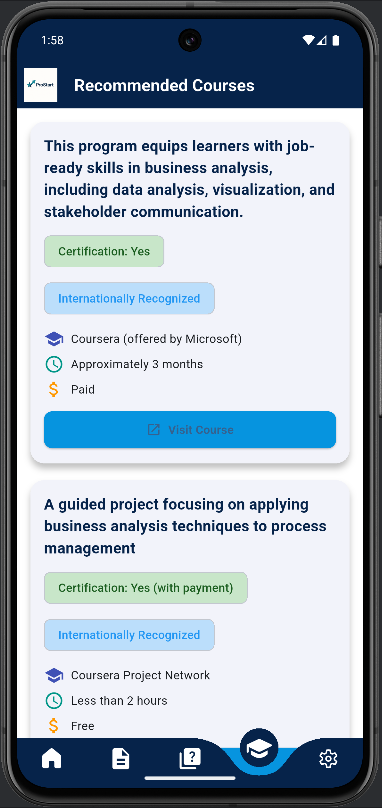

# 🚀 ProStart
### Smart Career Guidance App for Fresh Graduates

> **ProStart** is a smart mobile application that helps **fresh graduates** discover their ideal IT career path using **AI-powered CV analysis**, **job-based quizzes**, and **personalized course recommendations**.

📌 Final Year Project (PFE)  
📱 Built with **Flutter**, **Firebase**, and **FastAPI (AI)**

---

## ✨ Why ProStart?

✅ Unsure which IT career fits you best?  
✅ No professional experience yet?  
✅ Need real guidance, not generic advice?

👉 **ProStart turns uncertainty into direction.**

---

## 🎥 App Preview

### 🏠 Home & Dashboard

### 🧠 Job-Oriented Quiz

### 📄 AI CV Analysis

### 🎓 Course Recommendations

> 📌 Replace these images with real screenshots later  
> `assets/screenshots/*.png`

---

## 🔥 Core Features

### 👤 User Experience
- Secure authentication (Firebase)
- Editable profile with avatar
- Smooth UI with animations
- Real-time Firestore synchronization

### 🧠 Smart Quiz System
- Job-based quizzes (stored in Firebase)
- Multiple question types:
    - Multiple Choice
    - True / False
    - Coding Questions
- Real-time scoring
- **Dynamic matched job calculation**

### 📄 AI CV Analysis
- Upload PDF CV directly from device
- AI pipeline:
    - **DocTR** → CV text extraction
    - **spaCy** → NLP & skill detection
- CV improvement feedback

### 🎓 Course Recommendation
- Courses linked to matched job
- Stored in Firebase Firestore
- Course details:
    - Overview
    - Platform
    - Cost
    - Duration
    - Certification
- Click tracking for analytics

### 🛠 Admin Module
- Manage quiz questions
- Manage courses
- Update Firestore data dynamically

---

## 🧠 How It Works

